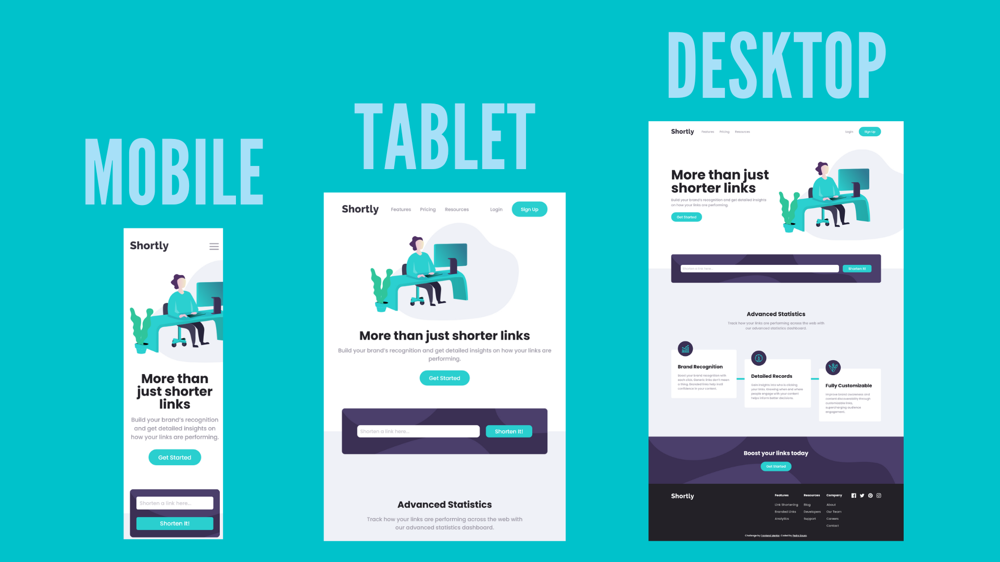

# Frontend Mentor - Shortly URL shortening API Challenge solution

This is a solution to the [Shortly URL shortening API Challenge challenge on Frontend Mentor](https://www.frontendmentor.io/challenges/url-shortening-api-landing-page-2ce3ob-G). Frontend Mentor challenges help you improve your coding skills by building realistic projects. 

## Table of contents

- [Overview](#overview)
  - [Screenshots](#screenshots)
  - [The challenge](#the-challenge)
  - [Links](#links)
- [My process](#my-process)
  - [Built with](#built-with)
  - [What I learned](#what-i-learned)
  - [Continued development](#continued-development)
  - [Useful resources](#useful-resources)
- [Author](#author)

## Overview

### Screenshots

### The challenge

Users should be able to:

- View the optimal layout for the site depending on their device's screen size
- Shorten any valid URL
- See a list of their shortened links, even after refreshing the browser
- Copy the shortened link to their clipboard in a single click
- Receive an error message when the `form` is submitted if:
  - The `input` field is empty

### Links

- Solution URL: [Frontend Mentor](https://www.frontendmentor.io/solutions/responsive-url-shortening-page-with-vanilla-html-css-and-javascript-CYEzXmycyx)
- Live Site URL: [Github Pages](https://pedrohsouza.github.io/url-shortening-api-master/)

## My process

### Built with

- Semantic HTML5 markup
- CSS custom properties
- Flexbox
- Mobile-first workflow
- Javascript

### What I learned

This is my third submission to Frontend Mentor and I've could learn a lot with it, some of the developed abilities are as it follows:

- Using the fetch API to retrieve data from a public API.
- Rendering data retrieved from a API dinamically on the page using the DOM API.
- Using the localstorage to store data and using that data to rerender the data when the page is reloaded.
- Solidify my HTML and CSS skills by building a fully responsive landing page.

Some of the challenges I faced:

- Adapting the layout for different screen sizes without breaking the previous work done.
- As I don't have a pro subscription I don't have access to the sketch files, so it was a bit of challenge to guess the layout for intermediate screen sizes as found in tablets.
- At first the clipboard API had some compatibility issues on mobile browsers, but that was fixed with the last update (at least in chrome version: 103).
- The localStorage was storing the data in a seemingly random way. I solved it by - creating an array with the keys and sorting it with the sort() method before rendering the retrieved data from the local storage, for reference see: [localStorage sort](https://stackoverflow.com/questions/3959817/html5-local-storage-sort).
- In addition to the blank link error message described in the challenge instructions I also have added others, like for a invalid link. The way I did it was just by adding the error message present in the response sent by the API.

### Continued development

For now I'll call it a day (it has been two weeks on it with this challenge) but for future updates I'd like to add an option to clean the links once you don't need them anymore.

On future projects I'd like to use a CSS preprocessor like SASS to help me style the page more easily and maybe a library like React to render the page dinamically.

### Useful resources

- [Clipboard (Copy & Paste)](https://whatwebcando.today/clipboard.html) - This article helped me with the use of the clipboard API.
- [localStorage in JavaScript: A complete guide](https://blog.logrocket.com/localstorage-javascript-complete-guide/#:~:text=localStorage%20in%20JavaScript.-,What%20is%20localStorage%20in%20JavaScript%3F,the%20browser%20window%20is%20closed.) - This is an amazing article which helped me to understand how to use the localStorage.
- [How to Get Current Date & Time in JavaScript](https://tecadmin.net/get-current-date-time-javascript/) - I needed a way to differentiate beetween keys as I stored data in the localStorage, so a way I found to do this was by naming them with the current time. This article helped me to understand how to get that information with native javascript methods.

## Author

- Github - [@pedrohsouza](https://github.com/pedrohsouza)
- Frontend Mentor - [@pedrohsouza](https://www.frontendmentor.io/profile/pedrohsouza)

